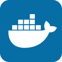

<h1 align=center>Hi there, I'm Kai - aka <a href="https://kazuto.de">Kazuto</a> 👋</h3>

  
  
  
    
  

<h2 align=center>And I'm a Developer and Designer</h3>

  I'm a trained and certified Graphic Designer but quickly fell in love with web design and so I expanded my stack and became a FrontEnd-Developer. Through PHP and MySQL though I got more in touch with systems and architectures behind large-scale websites and web applications, and so my scope slowly developed towards FullStack-Developer.

---

- Goal: Contributing more to open source projects 
- Fun Fact: I play guitar and bass

<h6 align=center>Languages and Tools</h6>

  
  
  
  
  
  
  
  
  
  
  
  
  
  
  

###### Recent GitHub Activity

<!--START_SECTION:activity-->
1. 🗣 Commented on [#23758](https://github.com/brave/brave-browser/issues/23758) in [brave/brave-browser](https://github.com/brave/brave-browser)
2. ❗️ Opened issue [#23758](https://github.com/brave/brave-browser/issues/23758) in [brave/brave-browser](https://github.com/brave/brave-browser)
3. 💪 Opened PR [#74](https://github.com/imTigger/laravel-job-status/pull/74) in [imTigger/laravel-job-status](https://github.com/imTigger/laravel-job-status)
4. ❗️ Closed issue [#7146](https://github.com/mekanism/Mekanism/issues/7146) in [mekanism/Mekanism](https://github.com/mekanism/Mekanism)
5. ❗️ Opened issue [#7146](https://github.com/mekanism/Mekanism/issues/7146) in [mekanism/Mekanism](https://github.com/mekanism/Mekanism)
<!--END_SECTION:activity--> 

 
 

---

  

